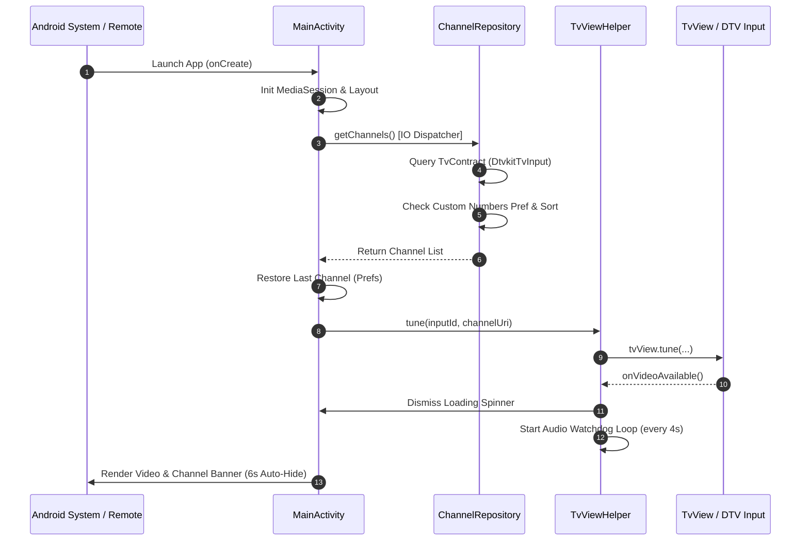

# VividOrbit Live TV

[](https://developer.android.com)
[](https://developer.android.com)
[](https://kotlinlang.org/)
[](https://developer.android.com/tv)
[](LICENSE)

**VividOrbit** is a high-performance, television-native Live TV client engineered specifically for Android TV, set-top boxes (STBs), and smart TVs. Built on top of Android's native `TvView` framework and `TvContract` Content Provider, VividOrbit provides low-latency hardware tuning, intelligent audio recovery, custom linear channel reordering with duplicate conflict resolution, and a streamlined Leanback interface optimized for remote control navigation.

---

## 📑 Table of Contents

- [Core Features](#-core-features)
- [Custom Channel Numbers & Lineup Management](#-custom-channel-numbers--lineup-management)
- [How It Works: Step-by-Step System Flow](#-how-it-works-step-by-step-system-flow)
  - [1. App Startup & Hardware Initialization](#1-app-startup--hardware-initialization)
  - [2. Channel Discovery & Smart Sorting](#2-channel-discovery--smart-sorting)
  - [3. Direct Playback & State Restoration](#3-direct-playback--state-restoration)
  - [4. Proactive Audio Recovery Watchdog](#4-proactive-audio-recovery-watchdog)
  - [5. Remote Navigation & Debounced Zapping](#5-remote-navigation--debounced-zapping)
  - [6. Direct Numeric Keypad Tuning](#6-direct-numeric-keypad-tuning)
  - [7. Channel Guide & Center-Locked Navigation](#7-channel-guide--center-locked-navigation)
  - [8. Channel Settings & Lineup Manager](#8-channel-settings--lineup-manager)
  - [9. Asynchronous Logo Pipeline & Caching](#9-asynchronous-logo-pipeline--caching)
  - [10. Lifecycle Teardown & Resource Release](#10-lifecycle-teardown--resource-release)
- [Architecture & Component Breakdown](#-architecture--component-breakdown)
- [Remote Control & Keypad Mapping](#-remote-control--keypad-mapping)
- [Design System & UI Specs](#-design-system--ui-specs)
- [Setup & Build Instructions](#-setup--build-instructions)
- [Hardware & Permissions Configuration](#-hardware--permissions-configuration)
- [License](#-license)

---

## 🌟 Core Features

- 📺 **Native TvView Playback**: Zero-overhead video rendering utilizing Android's `android.media.tv.TvView` with hardware decoder acceleration.
- 🔢 **Custom Linear Channel Numbers**: User-assigned custom channel numbering and linear sequencing with an in-app toggle to switch between custom and DTH broadcast numbers.
- 🔄 **Atomic Duplicate Swap**: Intelligent number assignment that automatically swaps numbers if an assignment conflicts with an existing channel, guaranteeing complete lineup uniqueness.
- ⚡ **Auto-Renumber 1..N**: One-touch sequential renumbering to convert arbitrary DTH channel numbers into clean, contiguous linear ordering.
- 🛡️ **Automated Audio Watchdog**: Background watchdog that verifies stream track validity every 4 seconds, recovering from silent renegotiations or audio drops common in DTV tuner HALs.
- 🎮 **Debounced Remote Zapping**: Instant UI feedback on channel buttons with 300ms tuning debounce on held keys, preventing hardware tuner saturation during rapid scrolling.
- 🎯 **Center-Locked Focus Scrolling**: Custom `RecyclerViewFocusCentering` keeping the active channel highlight locked to the vertical center of the guide.
- 🖼️ **High-Performance Async Logo Cache**: Background content provider decoding with downsampling and LRU memory caching to eliminate UI thread hitching.
- 📻 **MediaSession State Sync**: Integrated `MediaSession` playback states to prevent TV sleep during playback and maintain system media compliance.

---

## ⚙️ Custom Channel Numbers & Lineup Management

```
┌─────────────────────────────────────────────────────────────┐
│ Channels · 142               [ ⚙ Settings ] ◄── (Guide Header)
├─────────────────────────────────────────────────────────────┤
│ [1]  BBC News                                               │
│ [2]  CNN International                                      │
│ [3]  Discovery Channel                                      │
└─────────────────────────────────────────────────────────────┘
                               │
                               ▼
┌─────────────────────────────────────────────────────────────┐
│  CHANNEL SETTINGS & LINEUP                      [ Close ]   │
├─────────────────────────────────────────────────────────────┤
│  [ Custom Channel Numbers ]                     [ ON | OFF ]│
│  Order channels linearly with custom assigned numbers       │
│                                                             │
│  [ Auto-Renumber 1..N ]          [ Reset to DTH ]           │
├─────────────────────────────────────────────────────────────┤
│  [#1]  BBC News            DTH: 102           [ Edit ]      │
│  [#2]  CNN International   DTH: 105           [ Edit ]      │
│  [#3]  Discovery Channel   DTH: 210           [ Edit ]      │
└─────────────────────────────────────────────────────────────┘
```

1. **Preference Toggle**: Located inside the dedicated Channel Settings menu. Turning the toggle `OFF` immediately reverts to original broadcaster DTH numbers without losing custom assignments.
2. **Assigning Numbers**: Select any channel in the Lineup Editor to open the **Assign Channel Number** dialog. Type the desired number using remote keys `0`–`9`.
3. **No Duplicate Numbers (Atomic Swap)**: If number `5` is already assigned to Channel A, assigning `5` to Channel B will automatically give Channel A Channel B's previous number.
4. **Auto-Renumbering**: Pressing `[ Auto-Renumber 1..N ]` automatically numbers all available channels consecutively from 1 to N in linear sequence.

---

## 🔄 How It Works: Step-by-Step System Flow



### 1. App Startup & Hardware Initialization
1. `MainActivity.onCreate()` sets the window flag `FLAG_KEEP_SCREEN_ON` to prevent display dimming.
2. Initializes an active `android.media.session.MediaSession` (`"VividOrbitLiveTv"`) to signal active media consumption to the OS.
3. Sets up view hierarchies: `TvView`, loading `ProgressBar`, status messages, channel guide sidebar, settings overlay panel, numeric keypad card, and bottom banner overlay.
4. Checks runtime permissions for `READ_EPG_DATA` and `READ_TV_LISTINGS`.

### 2. Channel Discovery & Smart Sorting
1. `ChannelRepository.getChannels()` runs on `Dispatchers.IO`.
2. Queries the content provider via `TvContract.buildChannelsUriForInput()` targeted to the hardware tuner input (`com.droidlogic.dtvkit.inputsource/.DtvkitTvInput/HW19`).
3. Checks `isCustomNumbersEnabled()`:
   - **When ON**: Loads custom numbers JSON mapping, applies custom numbers to channels, and sorts in ascending linear numerical order (1, 2, 3...).
   - **When OFF**: Retains original broadcast LCNs (`originalDisplayNumber`) and sorts in standard DTH order.

### 3. Direct Playback & State Restoration
1. `MainActivity.loadChannelData()` checks `SharedPreferences` (`PREF_LAST_CHANNEL_ID`) to locate the last-viewed channel.
2. Automatically tunes to that channel (or the first channel on first launch).
3. Opens straight into full-screen video with the bottom channel banner visible for 6 seconds (`BANNER_AUTO_HIDE_MS`).

### 4. Proactive Audio Recovery Watchdog
1. `TvViewHelper` runs a background watchdog runnable every 4,000 ms (`AUDIO_WATCHDOG_INTERVAL_MS`).
2. Queries `tvView.getTracks(TvTrackInfo.TYPE_AUDIO)` and verifies if the currently selected track ID is present in the active list.
3. If no valid track is selected, it immediately re-selects the preferred or default audio track automatically.

### 5. Remote Navigation & Debounced Zapping
1. Pressing `CHANNEL_UP`, `CHANNEL_DOWN`, `DPAD_UP`, or `DPAD_DOWN` updates the selection and banner immediately.
2. **Single Press**: Issues a `tune()` immediately.
3. **Button Held Down**: Debounces tuning with a 300 ms delay (`ZAP_DEBOUNCE_MS`), tuning only the channel settled on when the button is released.

### 6. Direct Numeric Keypad Tuning
1. Pressing numeric keys (`0`–`9`) on a TV remote displays the floating numeric entry card in the top-right corner.
2. Matches against active `displayNumber` (custom or DTH depending on toggle state).
3. A 3-second auto-commit timer (`NUMERIC_ENTRY_TIMEOUT_MS`) counts down on every digit entered, or commits immediately on `DPAD_CENTER` / `ENTER`.

### 7. Channel Guide & Center-Locked Navigation
1. Pressing `MENU` or `GUIDE` toggles the channel guide sidebar.
2. Auto-scrolls to the currently playing channel.
3. `RecyclerViewFocusCentering` keeps the highlighted row locked to the vertical center during scrolling.

### 8. Channel Settings & Lineup Manager
1. Clicking `[ ⚙ Settings ]` in the guide header opens the Settings overlay.
2. Allows toggling custom numbers, running one-touch linear renumbering, or editing individual channel numbers with live conflict preview.

### 9. Asynchronous Logo Pipeline & Caching
1. `ChannelLogoLoader` maintains an in-memory `LruCache<Long, Bitmap>` allocating 1/8th of the app's maximum runtime memory.
2. Bitmaps are decoded off the main thread with downsampling to target dimensions (~100px) and `Bitmap.Config.RGB_565` format.

### 10. Lifecycle Teardown & Resource Release
1. `onStop()`: Completes (`finish()`) when leaving the app to release tuner hardware.
2. `onDestroy()`: Releases `MediaSession`, cancels handlers and coroutines, unregisters `TvView` callbacks, and resets `TvView`.

---

## 🏗️ Architecture & Component Breakdown

```
VividOrbit/
├── app/
│   ├── src/main/
│   │   ├── java/com/vividorbit/livetv/
│   │   │   ├── MainActivity.kt               # Central coordinator: lifecycle, UI overlays, remote key dispatcher
│   │   │   ├── data/
│   │   │   │   ├── Channel.kt                # Model for channel identity, DTH number, custom number, and logo URI
│   │   │   │   └── ChannelRepository.kt      # ContentResolver queries, custom number JSON persistence, uniqueness swap
│   │   │   ├── player/
│   │   │   │   └── TvViewHelper.kt           # TvView callback orchestration and automated audio track watchdog
│   │   │   └── ui/
│   │   │       ├── ChannelAdapter.kt         # Leanback TV channel list adapter with DiffUtil and playback indicators
│   │   │       ├── ChannelSettingsAdapter.kt # Settings lineup adapter for editing channel numbers
│   │   │       ├── ChannelLogoLoader.kt      # Memory-cached LRU bitmap loader with background downsampled decoding
│   │   │       └── RecyclerViewFocusCentering.kt  # View extension keeping focused items centered in the RecyclerView
│   │   └── res/
│   │       ├── layout/
│   │       │   ├── activity_main.xml         # ConstraintLayout hosting TvView, sidebar, settings, banner, and modals
│   │       │   ├── item_channel.xml          # TV guide row item layout
│   │       │   └── item_channel_settings.xml # Settings lineup row layout with DTH and custom number badges
│   │       ├── drawable/                     # TV focus states, button selectors, and backgrounds
│   │       └── values/                       # Colors, styles, and string resources
│   └── libs/
│       └── mochitif-release.aar              # Dtvkit / Droidlogic hardware tuner integration archive
```

---

## 🎮 Remote Control & Keypad Mapping

| Remote Button / Keycode | Context | Action Performed |
| :--- | :--- | :--- |
| **DPAD UP / DOWN** | Full Screen | Switch to previous / next channel |
| **DPAD UP / DOWN** | Sidebar Guide / Settings | Navigate up / down through list |
| **CHANNEL UP / DOWN** | Any | Next / previous channel with 300ms hold debounce |
| **DPAD CENTER / ENTER** | Full Screen | Display bottom channel information banner |
| **DPAD CENTER / ENTER** | Sidebar Guide | Tune to selected channel and close sidebar |
| **DPAD CENTER / ENTER** | Settings Lineup | Open number editor for selected channel |
| **Numeric Keys (0–9)** | Full Screen | Open numeric entry card and buffer digits |
| **Numeric Keys (0–9)** | Number Editor Modal | Type new custom channel number |
| **MENU / GUIDE** | Any | Toggle channel guide sidebar open / closed |
| **BACK** | Number Editor Modal | Cancel number edit and close modal |
| **BACK** | Settings Menu | Close Settings menu and return to Guide |
| **BACK** | Sidebar Guide | Close sidebar guide |
| **BACK** | Full Screen | System back / Exit app |

---

## 🎨 Design System & UI Specs

VividOrbit utilizes a television-grade dark aesthetic designed for high contrast and legible reading from across the room:

- **Monochrome Base**:
  - Main Background: `#0B0B0C` (`@color/bg_dark`)
  - Sidebar / Settings Panel: `#161618` (`@color/panel_bg`)
  - Elevated Cards (Banner, Modals): `#1D1D20` (`@color/panel_bg_elevated`)
  - Hairline Separators: `#29292C` (`@color/hairline`)
- **Typography & Hierarchy**:
  - Primary Text: `#F2F2F3` (`@color/text_primary`)
  - Secondary Text: `#8A8A8E` (`@color/text_secondary`)
  - Channel Numbers: Large, light font (`sans-serif-light`)
  - Channel Titles: Medium weight (`sans-serif-medium`)
- **Focus & Selection**:
  - Selected Row: Tinted background `#1B1B1E` with hairline border
  - Focused Control / Row: High-contrast `#26262A` with 2dp solid `#F2F2F3` border outline
- **Accent Indicators**:
  - Live Broadcast: Red accent `#E5484D` (`@color/live_red`)
  - Toggle ON State: Green accent `#30A46C` (`@color/toggle_on_green`)

---

## 🛠️ Setup & Build Instructions

### Prerequisites
- **Android Studio** Hedgehog (2023.1.1) or newer
- **JDK 17** (configured in Gradle and IDE settings)
- **Android TV Device or Emulator** running Android 9.0 (API 28) or higher
- Hardware or software TV Input Service supporting `TvContract` (e.g. Dtvkit or TIF emulation)

### Build via Command Line

```bash
# Clone the repository
git clone https://github.com/tinyredphoenix/VividOrbit.git
cd VividOrbit

# Build Debug APK
./gradlew assembleDebug

# Build Release APK
./gradlew assembleRelease
```

The compiled APK will be located in `app/build/outputs/apk/debug/app-debug.apk`.

### Installing to Android TV via ADB

```bash
# Connect to your Android TV over network ADB
adb connect <TV_IP_ADDRESS>:5555

# Install the application
adb install -r app/build/outputs/apk/debug/app-debug.apk

# Launch the app
adb shell monkey -p com.vividorbit.livetv -c android.intent.category.LAUNCHER 1
```

---

## 🔒 Hardware & Permissions Configuration

VividOrbit declares and requires the following permissions in `AndroidManifest.xml`:

```xml
<uses-permission android:name="com.android.providers.tv.permission.READ_EPG_DATA" />
<uses-permission android:name="android.permission.READ_TV_LISTINGS" />

<uses-feature android:name="android.software.leanback" android:required="true" />
<uses-feature android:name="android.hardware.touchscreen" android:required="false" />
```

---

## 📜 License

This project is open source and available under the [Apache License 2.0](LICENSE).
