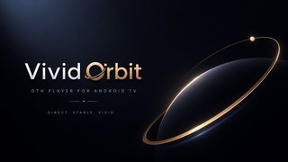

# 🪐 VividOrbit — Premium Live TV & Lineup Manager for Android TV

<p align="center">
  
</p>

<p align="center">
  <b>A lightweight, blazing-fast, 100% offline Live TV experience for Android TV & Google TV devices.</b><br>
  Features custom channel numbering with atomic collision resolution, embedded phone-based lineup management over QR code, now/next EPG integration, and instant channel recall.
</p>

<p align="center">
  
  
  
  
  
  
</p>

---

## ✨ Key Features

### 📺 1. High-Performance TV Playback Engine
* **Universal Tuner Discovery**: Auto-detects all available hardware tuners via Android's `TvInputManager` (DVB-T/T2, DVB-S/S2, DVB-C, ATSC, and OEM inputs).
* **Hardware-Accelerated Full Bleed**: 100% full-screen video rendering via `TvView` with zero letterboxing.
* **Smart Zapping Buffer**: 120ms debounce on channel flips prevents tuner thrashing while delivering instantaneous audio/video playback.
* **Memory-Optimized Image Pipeline**: Multi-level LRU logo cache with negative caching and uniform 200px decoding to prevent memory spikes on low-RAM Set-Top Boxes.

### 🔢 2. Custom Channel Numbering & Atomic Swapping
* **Linear Numbering**: Reorder channels consecutively (1, 2, 3...) regardless of awkward broadcaster LCNs.
* **Atomic Conflict Resolution**: Assigning an existing number to a channel automatically swaps numbers with the conflicting channel, preventing duplicate or missing entries.
* **One-Touch Auto-Renumber**: Renumber your entire lineup from `1..N` with a single click.
* **Broadcaster Fallback**: Toggle back to original DTH numbers at any time without losing your custom map.

### 📱 3. Phone Configuration over QR Code (Local Web UI)
* **Zero Cloud / 100% Offline**: Embedded multi-threaded HTTP server runs locally on the TV (port `8080`).
* **Cryptographic Token Auth**: Dynamic 32-character session token verified with constant-time comparison prevents unauthorized LAN writes.
* **Offline Detection**: Graceful UI detection when TV has no network connection with a one-click Retry option.
* **Rich Mobile Web App (`assets/web/index.html`)**:
  * Real-time search and filter by name or number.
  * Move Up, Down, and "Move to Top" controls.
  * Inline number editing with conflict swap.
  * **Phone as Remote**: Tap "📺 Tune" next to any channel to switch the TV live.
  * **Lineup Backup & Restore**: Export and import full channel lineups as JSON files keyed by channel name.
  * **Live Synchronization**: Edits made on your phone reflect on the TV screen in under 500ms via non-blocking `DiffUtil`.

### 📅 4. Now / Next EPG with Adaptive Fallback
* **Asynchronous EPG Fetcher**: Queries `TvContract.Programs` on background coroutines with an in-memory 60-second TTL cache.
* **Broadcast Progress Bar**: Shows current program title, formatted time window (*"9:00 PM – 9:30 PM"*), live percentage bar, and upcoming *"Next: ..."* show.
* **Bulletproof No-Data Collapse**: If the tuner source provides no EPG data, the banner collapses cleanly into a single-row channel badge with zero layout shifts or empty boxes.

### ⭐ 5. Favorites System & Quick Last-Channel Recall
* **Instant Recall**: Long-pressing `BACK` (or pressing remote `KEYCODE_LAST_CHANNEL`) while watching TV immediately jumps back to the previously tuned channel.
* **Favorites Filtering**: Filter the guide sidebar between **[ All Channels ]** and **[ ★ Favorites ]**.
* **Remote Shortcuts**: Dedicated yellow/blue TV remote keys toggle favorite status on the fly.
* **Live Web Sync**: Star/unstar channels from your phone browser with instant TV updates.

### 🚀 6. Startup Channel Resolution Matrix
* **Configurable Startup**: Choose between `Last Watched`, `Fixed Default Channel` (e.g. *Zee TV HD*), or `First in List`.
* **Indestructible Fallback Chain**: `LAST_WATCHED` $\rightarrow$ `FIXED_DEFAULT` $\rightarrow$ `FIRST_CHANNEL` guarantees the app never launches onto a blank screen after tuner rescans.
* **Quick-Set Long-Press**: Long-press `DPAD_CENTER` on any channel in the guide or settings to set it as your default startup channel.

### 🛡️ 7. TV Standards & Accessibility Compliance
* **Leanback Overscan Margins**: 48dp horizontal and 27dp vertical safe-area margins applied to all overlay cards and sidebars.
* **TalkBack Single-Node Accessibility**: Screen readers announce a natural phrase (*"Channel 1, Zee TV HD, now playing Kumkum Bhagya"*).
* **Destructive Action Confirmations**: Confirmation modal protects against accidental `Auto-Renumber` or `Reset to DTH` clicks.

---

## 🏗️ Project Architecture & Structure

```
VividOrbit/
├── app/
│   ├── build.gradle                            # Dependencies, build types, R8 & test options
│   ├── proguard-rules.pro                      # ProGuard/R8 rules for Android TV & ZXing
│   └── src/
│       ├── main/
│       │   ├── AndroidManifest.xml             # TV intent filters, banner, permissions
│       │   ├── assets/
│       │   │   └── web/
│       │   │       └── index.html              # Mobile Web App for Phone Setup (CSS/JS embedded)
│       │   ├── java/com/vividorbit/livetv/
│       │   │   ├── MainActivity.kt             # TV UI Controller, D-pad dispatch, state engine
│       │   │   ├── data/
│       │   │   │   ├── Channel.kt              # Immutable channel entity
│       │   │   │   ├── ChannelRepository.kt    # SharedPreferences persistence, tuner query, favorites
│       │   │   │   ├── EpgRepository.kt        # Async EPG loader with 60s memory cache
│       │   │   │   └── Program.kt              # EPG program model & progress calculations
│       │   │   ├── player/
│       │   │   │   └── TvViewHelper.kt         # TvView lifecycle wrapper & track management
│       │   │   ├── server/
│       │   │   │   ├── LocalConfigServer.kt    # Multi-threaded HTTP server with token auth
│       │   │   │   ├── NetworkUtils.kt         # LAN IP resolution on wlan0 / eth0
│       │   │   │   └── QrCodeGenerator.kt      # ZXing QR Bitmap renderer
│       │   │   └── ui/
│       │   │       ├── ChannelAdapter.kt       # Fast guide list adapter with DiffUtil
│       │   │       ├── ChannelDiff.kt          # Off-thread DiffUtil calculation
│       │   │       ├── ChannelLogoLoader.kt    # Multi-level LRU bitmap cache
│       │   │       ├── ChannelSettingsAdapter.kt # Channel renumbering settings list adapter
│       │   │       └── RecyclerViewFocusCentering.kt # TV D-pad focus centering helpers
│       │   └── res/
│       │       ├── drawable/                   # Background selectors, focus states, badge frames
│       │       │   ├── banner.png              # Android TV launcher banner
│       │       │   ├── logo.png                # App icon
│       │       │   └── ...
│       │       ├── layout/
│       │       │   ├── activity_main.xml       # Main TV layout, overlay sidebars, dialog cards
│       │       │   ├── item_channel.xml        # TV Guide row with logo, name, EPG, star
│       │       │   └── item_channel_settings.xml # Settings row with edit badge
│       │       └── values/
│       │           ├── colors.xml              # Dark TV theme palette
│       │           ├── strings.xml             # Extracted string resources
│       │           └── styles.xml              # Leanback dark theme definitions
│       └── test/java/com/vividorbit/livetv/
│           ├── FavoritesAndRecallTest.kt       # Unit tests for favorites & recall history
│           ├── ProgramTest.kt                  # Unit tests for EPG formatting & progress math
│           ├── StartupResolutionTest.kt        # Unit tests for startup fallback matrix
│           └── TokenValidationTest.kt          # Unit tests for constant-time token auth
├── gradle/                                     # Gradle wrapper
├── build.gradle                                # Root build configuration
└── PLAN.md                                     # Full release roadmap & engineering plan
```

---

## 🎮 TV Remote Control Mapping

| Remote Button / Key | Context | Action |
| :--- | :--- | :--- |
| `DPAD_UP` / `DPAD_DOWN` | Video Playback | Quick channel zapping (debounced) |
| `CHANNEL_UP` / `CHANNEL_DOWN` | Video Playback | Previous / Next channel |
| `0` – `9` (Numeric Keys) | Video Playback | Direct channel number entry (up to 4 digits) |
| `DPAD_CENTER` / `ENTER` | Video Playback | Toggle bottom Info Banner (EPG + Channel Info) |
| `GUIDE` / `MENU` | Video Playback | Open Guide Sidebar |
| `DPAD_LEFT` | Guide Sidebar | Open Channel Settings Menu |
| `DPAD_RIGHT` | Settings Menu | Return to Guide Sidebar |
| `BACK` | Guide / Menus | Close sidebar/modal and return to video |
| **`BACK` (Long Press)** | Fullscreen Video | **Quick Recall: Jump back to previous channel** |
| `LAST_CHANNEL` / `PREV` | Fullscreen Video | **Quick Recall: Jump back to previous channel** |
| **`PROG_YELLOW` / `BLUE`** | Video / Guide | **Toggle Favorite (★) on active channel** |
| `DPAD_CENTER` (Long Press) | Guide / Settings | **Set selected channel as Default Startup channel** |

---

## 🌐 Phone Setup & REST API Reference

When the user opens **📱 Phone Setup**, the TV displays a QR code containing `http://<TV_IP>:8080/?t=<SESSION_TOKEN>`. The local server supports the following endpoints:

| Method | Endpoint | Description | Payload Example |
| :--- | :--- | :--- | :--- |
| `GET` | `/` or `/index.html` | Serves the responsive mobile web application. | None |
| `GET` | `/api/state` | Returns all channels, favorites, startup mode, and custom numbering state. | None |
| `POST` | `/api/number` | Reassigns a channel number (with atomic swap on conflict). | `{"channelId": 101, "number": "5"}` |
| `POST` | `/api/reorder` | Sets custom linear ordering for a list of channel IDs. | `{"orderedChannelIds": [101, 102, 103]}` |
| `POST` | `/api/favorite` | Toggles favorite status for a channel. | `{"channelId": 101}` |
| `POST` | `/api/config` | Updates startup mode, custom number toggle, or default channel. | `{"startupMode": "fixed", "defaultChannelId": 101}` |
| `POST` | `/api/tune` | Tunes the TV directly to the specified channel. | `{"channelId": 101}` |
| `GET` | `/api/export` | Exports the full channel lineup as a portable JSON backup. | None |
| `POST` | `/api/import` | Restores channel lineup from a JSON backup (matches by name). | `[{"name": "Zee TV HD", "customNumber": "1"}]` |

---

## 🛠️ Build & Verification

### Prerequisites
* **Android SDK**: API 34 (Android 14)
* **JDK**: Version 17
* **Gradle**: 8.7+

### Run Automated Tests
```bash
./gradlew test
```

### Build Debug APK
```bash
./gradlew assembleDebug
# Output: app/build/outputs/apk/debug/app-debug.apk
```

### Build Production Release Bundle (AAB)
```bash
./gradlew bundleRelease
# Output: app/build/outputs/bundle/release/app-release.aab
```

---

## 🔒 Security & Privacy

* **100% Offline by Design**: VividOrbit never contacts any external cloud servers or APIs. All channel renumbering, favorites, and configuration data remain local on your TV.
* **Ephemeral Local Server**: The embedded configuration server runs **only** when Phone Setup is active on screen and terminates immediately when closed or when the app is backgrounded.
* **Constant-Time Verification**: All API requests require a cryptographic 32-character hex token verified using `MessageDigest.isEqual` to prevent timing attacks.

---

## 📄 License

Copyright © 2026 VividOrbit. All rights reserved.
